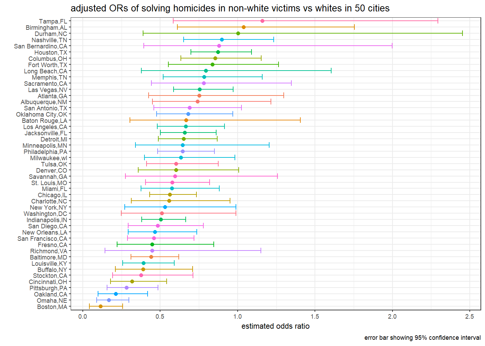

p8105\_hw6\_jq2293
================
JiyueQin
November 24, 2018

# Problem 1

This problem uses dataset about homicides in 50 large US cities.

## import and tidy

First, import the data from website and do some
cleaning.

``` r
homicide_data = read_csv("https://github.com/washingtonpost/data-homicides/raw/master/homicide-data.csv") %>% 
  unite(city_state, city, state, sep = ",", remove = FALSE) %>% 
  mutate(solved = as.numeric(disposition == "Closed by arrest")) %>% 
  filter(! city %in% c("Dallas","Phoenix","Kansas City") &
           city_state != "Tulsa,AL") %>% 
  mutate(victim_race = recode_factor(victim_race, White = "white", .default = "non-white"),
         victim_age = as.numeric(victim_age))
```

    ## Warning in evalq(as.numeric(victim_age), <environment>): NAs introduced by
    ## coercion

The initial cleaning steps include:

1.  using `unite()` to add a new variable `city_state`.

2.  using `mutate()` to add a new variable `solved`.

3.  using `filter()` to remove observations in certain cities which lack
    inforation of victim race.

4.  using `mutate()` to modify `victim_race` into categories of white
    and non-white and convert `victim_age` into numeric variable.

The resulting dataset `homicide_data` has 48507 rows and 14 columns.

Some key variables are:

  - `victim_race`: factor variable, white as reference.

  - `city_state`: character varibale, denotes the place of the crime.

  - `lat` and `lon`: numeric variable, denotes the geo location of the
    crime.

  - `solved`: numeric variable(binary), 1 denotes the crime is sloved,
    meaning closed by arrest. Otherwise, take 0.

## regression for Baltimore

Then, fit a logistic regression to the records in Baltimore. Outcome is
resolved vs unresolved and predictors are victim age, sex and race.

``` r
fit_logit_Bal =
  homicide_data %>% 
  filter(city == "Baltimore") %>% 
  glm(solved ~ victim_age + victim_sex + victim_race, data = ., family = binomial()) 

fit_logit_Bal %>% 
  broom::tidy() %>% 
  mutate(OR = exp(estimate),
         term = str_replace(term, "sex", "sex:"),
         term = str_replace(term, "race", "race:"))%>%
  select(term, log_OR = estimate, OR, p.value) %>% 
  knitr::kable(digits = 3)
```

| term                   | log\_OR |    OR | p.value |
| :--------------------- | ------: | ----: | ------: |
| (Intercept)            |   1.186 | 3.274 |   0.000 |
| victim\_age            | \-0.007 | 0.993 |   0.032 |
| victim\_sex:Male       | \-0.888 | 0.412 |   0.000 |
| victim\_race:non-white | \-0.820 | 0.441 |   0.000 |

``` r
result = confint(fit_logit_Bal) %>%
  as.data.frame() %>%
  mutate(term = row.names(.)) %>% 
  full_join(., broom::tidy(fit_logit_Bal), by = "term") %>% 
  select(term, log_OR = estimate, lower_log_OR = "2.5 %", upper_log_OR = "97.5 %") %>% 
  mutate(OR = exp(log_OR),
         lower_OR = exp(lower_log_OR),
         upper_OR = exp(upper_log_OR),
         term = str_replace(term, "sex", "sex:"),
         term = str_replace(term, "race", "race:"))
```

    ## Waiting for profiling to be done...

``` r
 knitr::kable(result, digits = 3)
```

| term                   | log\_OR | lower\_log\_OR | upper\_log\_OR |    OR | lower\_OR | upper\_OR |
| :--------------------- | ------: | -------------: | -------------: | ----: | --------: | --------: |
| (Intercept)            |   1.186 |          0.730 |          1.651 | 3.274 |     2.076 |     5.212 |
| victim\_age            | \-0.007 |        \-0.013 |        \-0.001 | 0.993 |     0.987 |     0.999 |
| victim\_sex:Male       | \-0.888 |        \-1.156 |        \-0.622 | 0.412 |     0.315 |     0.537 |
| victim\_race:non-white | \-0.820 |        \-1.164 |        \-0.479 | 0.441 |     0.312 |     0.620 |

From the results of the regression, we can see age, sex and race are all
significant predictors at 0.05 level.

For solving homicides, comparing non-white victims to white victims
keeping all other variables fixed, the estimated odds ratio is 0.441,
the 95% confidence is (0.312, 0.62). Here, odds ratio is computed using
`exp()` to transform original estimate. Smae for the confidence
interval.

This indicates non-white victims are more likely to have unsolved
homicides than white victims.

## regression for each city

Run glm for each of the cities and compute estimated ORs and CIs.

``` r
summary_reg = function(dataset){
  fit = glm(solved ~ victim_age + victim_sex + victim_race, data = dataset, family = binomial())
  confint(fit) %>%
  as.data.frame() %>%
  mutate(term = row.names(.)) %>% 
  full_join(., broom::tidy(fit), by = "term") %>% 
  select(term, log_OR = estimate, lower_log_OR = "2.5 %", upper_log_OR = "97.5 %") %>% 
  mutate(OR = exp(log_OR),
         lower_OR = exp(lower_log_OR),
         upper_OR = exp(upper_log_OR)) %>% 
  filter(term == "victim_racenon-white")

}

race_estimate = homicide_data %>% 
  group_by(city_state) %>% 
  nest() %>% 
  mutate(result = map(data, summary_reg)) %>% 
  select(-data) %>% 
  unnest() %>% 
  select(-term)
  
 knitr::kable(head(race_estimate), digits = 3)
```

| city\_state    | log\_OR | lower\_log\_OR | upper\_log\_OR |    OR | lower\_OR | upper\_OR |
| :------------- | ------: | -------------: | -------------: | ----: | --------: | --------: |
| Albuquerque,NM | \-0.299 |        \-0.800 |          0.195 | 0.741 |     0.449 |     1.215 |
| Atlanta,GA     | \-0.284 |        \-0.857 |          0.262 | 0.753 |     0.424 |     1.299 |
| Baltimore,MD   | \-0.820 |        \-1.164 |        \-0.479 | 0.441 |     0.312 |     0.620 |
| Baton Rouge,LA | \-0.404 |        \-1.190 |          0.340 | 0.668 |     0.304 |     1.405 |
| Birmingham,AL  |   0.039 |        \-0.492 |          0.562 | 1.039 |     0.612 |     1.754 |
| Boston,MA      | \-2.167 |        \-3.158 |        \-1.353 | 0.115 |     0.043 |     0.259 |

## plot

Finally, a plot is generated to visualize the adjusted odds ratios for
non-white victims compared to white victims.

``` r
race_estimate %>% 
  ggplot(aes(x = forcats::fct_reorder(city_state, OR), color = city_state)) +
  geom_point(aes(y = OR)) +
  geom_errorbar(aes(ymin = lower_OR, ymax = upper_OR)) +
  coord_flip() +
  labs(x = "",
       y = "estimated odds ratio",
       title = "adjusted ORs of solving homicides in non-white victims vs whites in 50 cities",
       caption = "error bar showing 95% confidence interval") + 
  theme_bw(base_size = 8) +
  theme(legend.position = "None")
```



From the plot, we can see Boston has the lowest odds ratio(less than
0.25), meaning in Boston, non-white victims are much less likely to have
solved homicides compared to white victims. Tampa, Birmingham and Durham
have Top3 highest odds ratio, which are a bit higher than 1, meaning the
probability of getting a solved homicide is similar between non-whites
and whites.

About half of the cities have confidence intervals smaller than 1, which
indicates in these cities, race is a significant predictor of
solved/unsolved homicide at 0.05 level.

# Problem 2

This problem uses dataset about children’s birthweight.

## import and tidy

First, import the data and clean for modeling.

``` r
birth_data = read_csv("data/birthweight.csv") %>% 
  mutate(babysex = recode_factor(babysex, `1` = "male", `2` = "female"),
         frace = recode_factor(frace, `1`= "White", `2` = "Black", `3` = "Asian",
                               `4` = "Puerto Rican", `8` = "Other"),
         malform = recode_factor(malform, `0` = "absent",`1` = "present"),
         mrace = recode_factor(mrace, `1`= "White", `2` = "Black", `3` = "Asian", `4` = "Puerto Rican")) %>% 
  select(-pnumlbw, -pnumsga)
```

    ## Parsed with column specification:
    ## cols(
    ##   .default = col_integer(),
    ##   gaweeks = col_double(),
    ##   ppbmi = col_double(),
    ##   smoken = col_double()
    ## )

    ## See spec(...) for full column specifications.

``` r
skimr::skim(birth_data)
```

    ## Skim summary statistics
    ##  n obs: 4342 
    ##  n variables: 18 
    ## 
    ## -- Variable type:factor ---------------------------------------------------------------------------------------------------
    ##  variable missing complete    n n_unique
    ##   babysex       0     4342 4342        2
    ##     frace       0     4342 4342        5
    ##   malform       0     4342 4342        2
    ##     mrace       0     4342 4342        4
    ##                               top_counts ordered
    ##              mal: 2230, fem: 2112, NA: 0   FALSE
    ##  Whi: 2123, Bla: 1911, Pue: 248, Asi: 46   FALSE
    ##                abs: 4327, pre: 15, NA: 0   FALSE
    ##  Whi: 2147, Bla: 1909, Pue: 243, Asi: 43   FALSE
    ## 
    ## -- Variable type:integer --------------------------------------------------------------------------------------------------
    ##  variable missing complete    n      mean     sd  p0  p25    p50  p75 p100
    ##     bhead       0     4342 4342   33.65     1.62  21   33   34     35   41
    ##   blength       0     4342 4342   49.75     2.72  20   48   50     51   63
    ##       bwt       0     4342 4342 3114.4    512.15 595 2807 3132.5 3459 4791
    ##     delwt       0     4342 4342  145.57    22.21  86  131  143    157  334
    ##   fincome       0     4342 4342   44.11    25.98   0   25   35     65   96
    ##  menarche       0     4342 4342   12.51     1.48   0   12   12     13   19
    ##   mheight       0     4342 4342   63.49     2.66  48   62   63     65   77
    ##    momage       0     4342 4342   20.3      3.88  12   18   20     22   44
    ##    parity       0     4342 4342    0.0023   0.1    0    0    0      0    6
    ##      ppwt       0     4342 4342  123.49    20.16  70  110  120    134  287
    ##    wtgain       0     4342 4342   22.08    10.94 -46   15   22     28   89
    ##      hist
    ##  <U+2581><U+2581><U+2581><U+2581><U+2585><U+2587><U+2581><U+2581>
    ##  <U+2581><U+2581><U+2581><U+2581><U+2581><U+2587><U+2581><U+2581>
    ##  <U+2581><U+2581><U+2581><U+2583><U+2587><U+2587><U+2582><U+2581>
    ##  <U+2581><U+2587><U+2585><U+2581><U+2581><U+2581><U+2581><U+2581>
    ##  <U+2581><U+2582><U+2587><U+2582><U+2582><U+2582><U+2581><U+2583>
    ##  <U+2581><U+2581><U+2581><U+2581><U+2582><U+2587><U+2581><U+2581>
    ##  <U+2581><U+2581><U+2581><U+2585><U+2587><U+2582><U+2581><U+2581>
    ##  <U+2582><U+2587><U+2585><U+2582><U+2581><U+2581><U+2581><U+2581>
    ##  <U+2587><U+2581><U+2581><U+2581><U+2581><U+2581><U+2581><U+2581>
    ##  <U+2581><U+2587><U+2586><U+2581><U+2581><U+2581><U+2581><U+2581>
    ##  <U+2581><U+2581><U+2581><U+2587><U+2587><U+2581><U+2581><U+2581>
    ## 
    ## -- Variable type:numeric --------------------------------------------------------------------------------------------------
    ##  variable missing complete    n  mean   sd    p0   p25   p50   p75 p100
    ##   gaweeks       0     4342 4342 39.43 3.15 17.7  38.3  39.9  41.1  51.3
    ##     ppbmi       0     4342 4342 21.57 3.18 13.07 19.53 21.03 22.91 46.1
    ##    smoken       0     4342 4342  4.15 7.41  0     0     0     5    60  
    ##      hist
    ##  <U+2581><U+2581><U+2581><U+2581><U+2583><U+2587><U+2581><U+2581>
    ##  <U+2581><U+2587><U+2585><U+2581><U+2581><U+2581><U+2581><U+2581>
    ##  <U+2587><U+2581><U+2581><U+2581><U+2581><U+2581><U+2581><U+2581>

This dataset `birth_data` has 4342 rows and 18 columns.

After using `skimr::skim()`, no missing value is found. Also, all the
values of `pnumlbw` and `pnumsga` are 0, which makes no sense for
regression and are removed. Using `recode_factor()` to transform
`babysex`, `frace`, `malform` and `mrace` into factors.

## regression

Propose a regression model for birthweight. This model may be based on a
hypothesized structure for the factors that underly birthweight, on a
data-driven model-building process, or a combination of the two.
Describe your modeling process and show a plot of model residuals
against fitted values – use add\_predictions and add\_residuals in
making this plot.

Here, multiple linear regression is adopted. Note, the distribution of
birthweight is approximatly normal, which satisfies the assumption for
statistical
inference.

``` r
bwt_mlr_1 = lm(bwt ~ gaweeks + malform + smoken + wtgain, data = birth_data)
summary(bwt_mlr_1)
```

    ## 
    ## Call:
    ## lm(formula = bwt ~ gaweeks + malform + smoken + wtgain, data = birth_data)
    ## 
    ## Residuals:
    ##      Min       1Q   Median       3Q      Max 
    ## -1761.39  -290.52    -1.11   294.64  1507.63 
    ## 
    ## Coefficients:
    ##                Estimate Std. Error t value Pr(>|t|)    
    ## (Intercept)    464.8044    86.4441   5.377 7.97e-08 ***
    ## gaweeks         62.8491     2.2109  28.427  < 2e-16 ***
    ## malformpresent   4.6266   117.5947   0.039    0.969    
    ## smoken          -6.5594     0.9319  -7.039 2.25e-12 ***
    ## wtgain           9.0060     0.6373  14.131  < 2e-16 ***
    ## ---
    ## Signif. codes:  0 '***' 0.001 '**' 0.01 '*' 0.05 '.' 0.1 ' ' 1
    ## 
    ## Residual standard error: 454.2 on 4337 degrees of freedom
    ## Multiple R-squared:  0.2143, Adjusted R-squared:  0.2136 
    ## F-statistic: 295.8 on 4 and 4337 DF,  p-value: < 2.2e-16

``` r
bwt_mlr_2 = lm(bwt ~ gaweeks + smoken + wtgain + bhead + blength + mrace , data = birth_data)
summary(bwt_mlr_2)
```

    ## 
    ## Call:
    ## lm(formula = bwt ~ gaweeks + smoken + wtgain + bhead + blength + 
    ##     mrace, data = birth_data)
    ## 
    ## Residuals:
    ##      Min       1Q   Median       3Q      Max 
    ## -1119.01  -187.74    -3.66   181.92  2408.13 
    ## 
    ## Coefficients:
    ##                     Estimate Std. Error t value Pr(>|t|)    
    ## (Intercept)       -5593.3409    98.6453 -56.702  < 2e-16 ***
    ## gaweeks              11.8042     1.4672   8.046 1.10e-15 ***
    ## smoken               -4.6036     0.5903  -7.798 7.81e-15 ***
    ## wtgain                3.7961     0.3927   9.667  < 2e-16 ***
    ## bhead               131.5902     3.4326  38.336  < 2e-16 ***
    ## blength              76.8092     2.0263  37.906  < 2e-16 ***
    ## mraceBlack         -143.8301     9.2879 -15.486  < 2e-16 ***
    ## mraceAsian         -119.0825    42.5656  -2.798  0.00517 ** 
    ## mracePuerto Rican  -132.1561    18.8204  -7.022 2.53e-12 ***
    ## ---
    ## Signif. codes:  0 '***' 0.001 '**' 0.01 '*' 0.05 '.' 0.1 ' ' 1
    ## 
    ## Residual standard error: 275.6 on 4333 degrees of freedom
    ## Multiple R-squared:  0.711,  Adjusted R-squared:  0.7104 
    ## F-statistic:  1332 on 8 and 4333 DF,  p-value: < 2.2e-16

``` r
birth_data %>% 
  add_residuals(bwt_mlr_2, var = "residual") %>% 
  add_predictions(bwt_mlr_2) %>% 
  ggplot(aes(x = pred, y = residual)) + 
  geom_point(alpha = .3) +
  labs(x = "fitted values",
       title = "distribution of model residuals against fitted values") 
```


At first, It is hypothesied that `gaweeks`, `malform`, `smoken` and
`wtgain` are predictors, but it turns out `malform` is not a significant
predictor, and the \(R^2\) is only 0.21, meaning the variance is
accounted for other variables.

Trying `gaweeks`, `smoken`, `wtgain`, `bhead`, `blength`, `mrace` as
predictors, we can see each predictor is significant and adjusted
\(R^2\) is 0.71, pretty similar to crude \(R^2\), meaning the set of
predictors here is reasonable. So the second model is used here.

In general, the plot shows that residuals are randomly scattered around
0, but three outliers are noticed.
