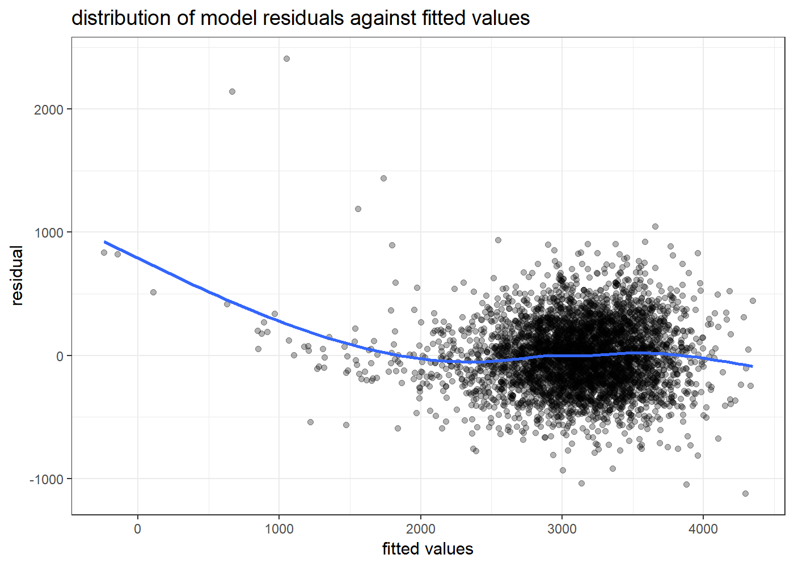

p8105\_hw6\_jq2293
================
JiyueQin
November 24, 2018

# Problem 1

This problem uses dataset about homicides in 50 large US cities.

## import and tidy

First, import the data from website and do some
cleaning.

``` r
homicide_data = read_csv("https://github.com/washingtonpost/data-homicides/raw/master/homicide-data.csv") %>% 
  unite(city_state, city, state, sep = ",", remove = FALSE) %>% 
  mutate(solved = as.numeric(disposition == "Closed by arrest")) %>% 
  filter(! city %in% c("Dallas","Phoenix","Kansas City") &
           city_state != "Tulsa,AL") %>% 
  mutate(victim_race = recode_factor(victim_race, White = "white", .default = "non-white"),
         victim_age = as.numeric(victim_age))
```

    ## Warning in evalq(as.numeric(victim_age), <environment>): NAs introduced by
    ## coercion

The initial cleaning steps include:

1.  using `unite()` to add a new variable `city_state`.

2.  using `mutate()` to add a new variable `solved`.

3.  using `filter()` to remove observations in certain cities which lack
    inforation of victim race.

4.  using `mutate()` to modify `victim_race` into categories of white
    and non-white and convert `victim_age` into numeric variable.

The resulting dataset `homicide_data` has 48507 rows and 14 columns.

Some key variables are:

  - `victim_race`: factor variable, white as reference.

  - `city_state`: character varibale, denotes the place of the crime.

  - `lat` and `lon`: numeric variable, denotes the geo location of the
    crime.

  - `solved`: numeric variable(binary), 1 denotes the crime is sloved,
    meaning closed by arrest. Otherwise, take 0.

## regression for Baltimore

Then, fit a logistic regression to the records in Baltimore. Outcome is
resolved vs unresolved and predictors are victim age, sex and race.

``` r
fit_logit_Bal =
  homicide_data %>% 
  filter(city == "Baltimore") %>% 
  glm(solved ~ victim_age + victim_sex + victim_race, data = ., family = binomial()) 

fit_logit_Bal %>% 
  broom::tidy() %>% 
  mutate(OR = exp(estimate),
         term = str_replace(term, "sex", "sex:"),
         term = str_replace(term, "race", "race:"))%>%
  select(term, log_OR = estimate, OR, p.value) %>% 
  knitr::kable(digits = 3)
```

| term                   | log\_OR |    OR | p.value |
| :--------------------- | ------: | ----: | ------: |
| (Intercept)            |   1.186 | 3.274 |   0.000 |
| victim\_age            | \-0.007 | 0.993 |   0.032 |
| victim\_sex:Male       | \-0.888 | 0.412 |   0.000 |
| victim\_race:non-white | \-0.820 | 0.441 |   0.000 |

``` r
result = confint(fit_logit_Bal) %>%
  as.data.frame() %>%
  mutate(term = row.names(.)) %>% 
  full_join(., broom::tidy(fit_logit_Bal), by = "term") %>% 
  select(term, log_OR = estimate, lower_log_OR = "2.5 %", upper_log_OR = "97.5 %") %>% 
  mutate(OR = exp(log_OR),
         lower_OR = exp(lower_log_OR),
         upper_OR = exp(upper_log_OR),
         term = str_replace(term, "sex", "sex:"),
         term = str_replace(term, "race", "race:"))
```

    ## Waiting for profiling to be done...

``` r
 knitr::kable(result, digits = 3)
```

| term                   | log\_OR | lower\_log\_OR | upper\_log\_OR |    OR | lower\_OR | upper\_OR |
| :--------------------- | ------: | -------------: | -------------: | ----: | --------: | --------: |
| (Intercept)            |   1.186 |          0.730 |          1.651 | 3.274 |     2.076 |     5.212 |
| victim\_age            | \-0.007 |        \-0.013 |        \-0.001 | 0.993 |     0.987 |     0.999 |
| victim\_sex:Male       | \-0.888 |        \-1.156 |        \-0.622 | 0.412 |     0.315 |     0.537 |
| victim\_race:non-white | \-0.820 |        \-1.164 |        \-0.479 | 0.441 |     0.312 |     0.620 |

From the results of the regression, we can see age, sex and race are all
significant predictors at 0.05 level.

For solving homicides, comparing non-white victims to white victims
keeping all other variables fixed, the estimated odds ratio is 0.441,
the 95% confidence is (0.312, 0.62). Here, odds ratio is computed using
`exp()` to transform original estimate. Smae for the confidence
interval.

This indicates non-white victims are more likely to have unsolved
homicides than white victims.

## regression for each city

Run glm for each of the cities and compute estimated ORs and CIs.

``` r
summary_reg = function(dataset){
  fit = glm(solved ~ victim_age + victim_sex + victim_race, data = dataset, family = binomial())
  confint(fit) %>%
  as.data.frame() %>%
  mutate(term = row.names(.)) %>% 
  full_join(., broom::tidy(fit), by = "term") %>% 
  select(term, log_OR = estimate, lower_log_OR = "2.5 %", upper_log_OR = "97.5 %") %>% 
  mutate(OR = exp(log_OR),
         lower_OR = exp(lower_log_OR),
         upper_OR = exp(upper_log_OR)) %>% 
  filter(term == "victim_racenon-white")

}

race_estimate = homicide_data %>% 
  group_by(city_state) %>% 
  nest() %>% 
  mutate(result = map(data, summary_reg)) %>% 
  select(-data) %>% 
  unnest() %>% 
  select(-term)
  
 knitr::kable(head(race_estimate), digits = 3)
```

| city\_state    | log\_OR | lower\_log\_OR | upper\_log\_OR |    OR | lower\_OR | upper\_OR |
| :------------- | ------: | -------------: | -------------: | ----: | --------: | --------: |
| Albuquerque,NM | \-0.299 |        \-0.800 |          0.195 | 0.741 |     0.449 |     1.215 |
| Atlanta,GA     | \-0.284 |        \-0.857 |          0.262 | 0.753 |     0.424 |     1.299 |
| Baltimore,MD   | \-0.820 |        \-1.164 |        \-0.479 | 0.441 |     0.312 |     0.620 |
| Baton Rouge,LA | \-0.404 |        \-1.190 |          0.340 | 0.668 |     0.304 |     1.405 |
| Birmingham,AL  |   0.039 |        \-0.492 |          0.562 | 1.039 |     0.612 |     1.754 |
| Boston,MA      | \-2.167 |        \-3.158 |        \-1.353 | 0.115 |     0.043 |     0.259 |

## plot

Finally, a plot is generated to visualize the adjusted odds ratios for
non-white victims compared to white victims.

``` r
race_estimate %>% 
  ggplot(aes(x = forcats::fct_reorder(city_state, OR), color = city_state)) +
  geom_point(aes(y = OR)) +
  geom_errorbar(aes(ymin = lower_OR, ymax = upper_OR)) +
  coord_flip() +
  labs(x = "",
       y = "estimated odds ratio",
       title = "adjusted ORs of solving homicides in non-white victims vs whites in 50 cities",
       caption = "error bar showing 95% confidence interval") + 
  theme_bw(base_size = 8) +
  theme(legend.position = "None")
```


From the plot, we can see Boston has the lowest odds ratio(less than
0.25), meaning in Boston, non-white victims are least likely to have
solved homicides compared to white victims. Tampa, Birmingham and Durham
have Top3 highest odds ratio, which are a bit higher than 1, meaning the
probability of getting a solved homicide is similar between non-whites
and whites.

Most cities have estimated odds ratio less than 1.0, showing the trend
that non-white victims are less likely to have solved homicides compared
to white victims.

About half of the cities have confidence intervals smaller than 1, which
indicates in these cities, race is a significant predictor of
solved/unsolved homicide at 0.05 level.

# Problem 2

This problem uses dataset about children’s birthweight.

## import and tidy

First, import the data and clean for modeling.

``` r
birth_data = read_csv("data/birthweight.csv") %>% 
  mutate(babysex = recode_factor(babysex, `1` = "male", `2` = "female"),
         frace = recode_factor(frace, `1`= "White", `2` = "Black", `3` = "Asian",
                               `4` = "Puerto Rican", `8` = "Other"),
         malform = recode_factor(malform, `0` = "absent",`1` = "present"),
         mrace = recode_factor(mrace, `1`= "White", `2` = "Black", `3` = "Asian", `4` = "Puerto Rican")) %>% 
  select(-pnumlbw, -pnumsga)
```

    ## Parsed with column specification:
    ## cols(
    ##   .default = col_integer(),
    ##   gaweeks = col_double(),
    ##   ppbmi = col_double(),
    ##   smoken = col_double()
    ## )

    ## See spec(...) for full column specifications.

``` r
skimr::skim(birth_data) %>% filter(stat == "missing")
```

    ## # A tibble: 18 x 6
    ##    variable type    stat    level value formatted
    ##    <chr>    <chr>   <chr>   <chr> <dbl> <chr>    
    ##  1 babysex  factor  missing .all      0 0        
    ##  2 bhead    integer missing .all      0 0        
    ##  3 blength  integer missing .all      0 0        
    ##  4 bwt      integer missing .all      0 0        
    ##  5 delwt    integer missing .all      0 0        
    ##  6 fincome  integer missing .all      0 0        
    ##  7 frace    factor  missing .all      0 0        
    ##  8 gaweeks  numeric missing .all      0 0        
    ##  9 malform  factor  missing .all      0 0        
    ## 10 menarche integer missing .all      0 0        
    ## 11 mheight  integer missing .all      0 0        
    ## 12 momage   integer missing .all      0 0        
    ## 13 mrace    factor  missing .all      0 0        
    ## 14 parity   integer missing .all      0 0        
    ## 15 ppbmi    numeric missing .all      0 0        
    ## 16 ppwt     integer missing .all      0 0        
    ## 17 smoken   numeric missing .all      0 0        
    ## 18 wtgain   integer missing .all      0 0

This dataset `birth_data` has 4342 rows and 18 columns.

After using `skimr::skim()`, no missing value is found. Also, all the
values of `pnumlbw` and `pnumsga` are 0, which makes no sense for
regression and are removed. Using `recode_factor()` to transform
`babysex`, `frace`, `malform` and `mrace` into factors.

## regression

Here, multiple linear regression is adopted. Note, the distribution of
birthweight is approximatly normal, which satisfies the assumption for
statistical
inference.

``` r
bwt_mlr_1 = lm(bwt ~ gaweeks + malform + smoken + wtgain, data = birth_data)
broom::tidy(bwt_mlr_1)
```

    ## # A tibble: 5 x 5
    ##   term           estimate std.error statistic   p.value
    ##   <chr>             <dbl>     <dbl>     <dbl>     <dbl>
    ## 1 (Intercept)      465.      86.4      5.38   7.97e-  8
    ## 2 gaweeks           62.8      2.21    28.4    3.74e-163
    ## 3 malformpresent     4.63   118.       0.0393 9.69e-  1
    ## 4 smoken            -6.56     0.932   -7.04   2.25e- 12
    ## 5 wtgain             9.01     0.637   14.1    2.33e- 44

``` r
broom::glance(bwt_mlr_1)
```

    ## # A tibble: 1 x 11
    ##   r.squared adj.r.squared sigma statistic   p.value    df  logLik    AIC
    ## *     <dbl>         <dbl> <dbl>     <dbl>     <dbl> <int>   <dbl>  <dbl>
    ## 1     0.214         0.214  454.      296. 3.21e-225     5 -32725. 65462.
    ## # ... with 3 more variables: BIC <dbl>, deviance <dbl>, df.residual <int>

``` r
bwt_mlr_2 = lm(bwt ~ gaweeks + smoken + wtgain + bhead + blength + mrace , data = birth_data)
broom::tidy(bwt_mlr_2)
```

    ## # A tibble: 9 x 5
    ##   term              estimate std.error statistic   p.value
    ##   <chr>                <dbl>     <dbl>     <dbl>     <dbl>
    ## 1 (Intercept)       -5593.      98.6      -56.7  0.       
    ## 2 gaweeks              11.8      1.47       8.05 1.10e- 15
    ## 3 smoken               -4.60     0.590     -7.80 7.81e- 15
    ## 4 wtgain                3.80     0.393      9.67 6.92e- 22
    ## 5 bhead               132.       3.43      38.3  3.88e-277
    ## 6 blength              76.8      2.03      37.9  8.28e-272
    ## 7 mraceBlack         -144.       9.29     -15.5  1.09e- 52
    ## 8 mraceAsian         -119.      42.6       -2.80 5.17e-  3
    ## 9 mracePuerto Rican  -132.      18.8       -7.02 2.53e- 12

``` r
broom::glance(bwt_mlr_2)
```

    ## # A tibble: 1 x 11
    ##   r.squared adj.r.squared sigma statistic p.value    df  logLik    AIC
    ## *     <dbl>         <dbl> <dbl>     <dbl>   <dbl> <int>   <dbl>  <dbl>
    ## 1     0.711         0.710  276.     1332.       0     9 -30554. 61128.
    ## # ... with 3 more variables: BIC <dbl>, deviance <dbl>, df.residual <int>

``` r
birth_data %>% 
  add_residuals(bwt_mlr_2, var = "residual") %>% 
  add_predictions(bwt_mlr_2) %>% 
  ggplot(aes(x = pred, y = residual)) + 
  geom_point(alpha = .3) +
  geom_smooth(se = FALSE) +
  labs(x = "fitted values",
       title = "distribution of model residuals against fitted values") 
```

    ## `geom_smooth()` using method = 'gam' and formula 'y ~ s(x, bs = "cs")'



At first, It is hypothesied that `gaweeks`, `malform`, `smoken` and
`wtgain` are predictors, but it turns out `malform` is not a significant
predictor, and the R^2 is only 0.21, meaning the variance is accounted
for other variables.

Trying `gaweeks`, `smoken`, `wtgain`, `bhead`, `blength`, `mrace` as
predictors, we can see each predictor is significant and adjusted R^2 is
0.71, pretty similar to crude R^2, meaning the set of predictors here is
reasonable. So the second model is used here.

In general, the plot shows that residuals are randomly scattered around
0, but some outliers can be noticed, and it has high residuals in the
area of low fitted values.

## cross validation

Make comparison in terms of the cross-validated prediction error with
another two models.

  - `model_1`: length at birth and gestational age as predictors.

  - `model_2`: head circumference, length, sex, and all interactions
    between these as predictors.

<!-- end list -->

``` r
set.seed(1)

cv_df = crossv_mc(birth_data, 100) %>% 
  mutate(model_1 = map(train, ~lm(bwt ~ blength + gaweeks, data = .x)),
         model_2 = map(train, ~lm(bwt ~ bhead + babysex + blength + bhead * babysex * blength, data = .x)),
         my_model = map(train, ~lm(bwt ~ gaweeks + smoken + wtgain + bhead + blength + mrace , data = .x))) %>% 
  mutate(rmse_model_1 = map2(model_1, test, ~rmse(model = .x, data = .y)),
         rmse_model_2 = map2(model_2, test, ~rmse(model = .x, data = .y)),
         rmse_my_model = map2(my_model, test, ~rmse(model = .x, data = .y)))

cv_df %>% 
  select(starts_with("rmse")) %>% 
  gather(key = model, value = rmse) %>% 
  unnest() %>% 
  mutate(model = str_replace(model, "rmse_", "")) %>% 
  ggplot(aes(x = model, y = rmse, fill = model)) + 
  geom_violin() +
  labs(title = "the distribution of rmse in different models") +
  theme(legend.position = "None") 
```


From the plot, we can see my model has lowest distribution in rmse,
while model\_1 has the highest distribution of rmse. In general, from
the perspective of distribution of rmse, I will keep my original model.
But considering the interaction model’s performance, it might be helpful
to add interaction term in my model.
